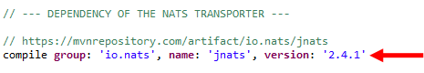
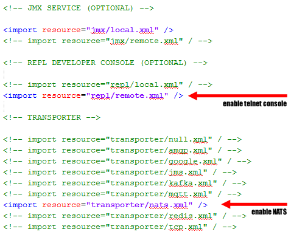
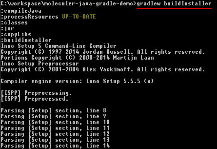
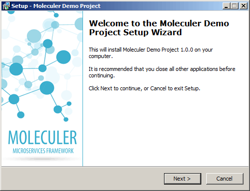
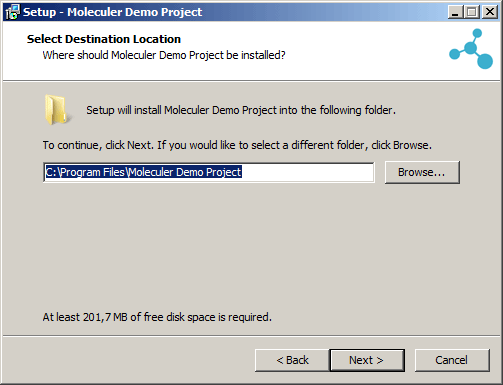
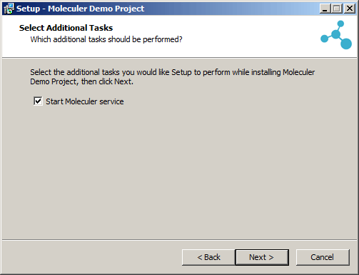
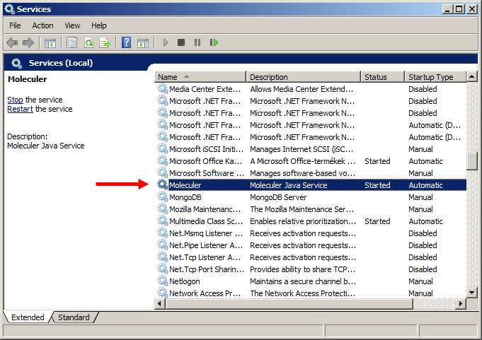
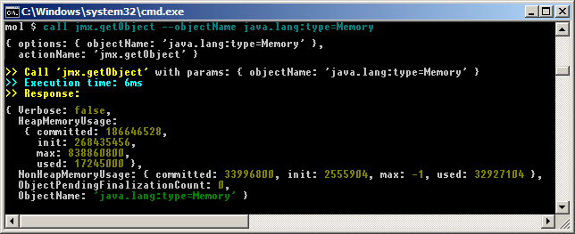

# Moleculer Java demo project for Spring Framework

The project demonstrates the framework of a functioning Moleculer-based application. The application is launched and configured using the Spring Framework, the configuration files are located in the "cfg" directory.

The project can be imported into Eclipse IDE.

The project also includes a "buildInstaller" Gradle command to create a **Windows Installer** from the project, and it will install the finished application as a 64-bit **Windows Service**.

The Windows Service creates a Moleculer Node that can be connected to another **Java or NodeJS-based** Moleculer Node. The connection parameters can be specified in the "cfg/moleculer.config.xml" file and and in the files of the "cfg/transporter" directory.

**Build Windows Installer**

The project does not include any transporter libraries (JARs). If you want to use transporters (such as Redis or NATS) the transporter libraries should be listed in the project dependencies list (in the "build.gradle" file). For example, to use NATS, remove comment prefix from the line of the NATS dependency.

In addition, you should specify in the "cfg/moleculer.config.xml" which transporter will be started. You can enable the telnet-based developer console in the same configuration file:

To create the installer, type "gradlew buildInstaller" in the project directory:

The executable installer will be generated into the "installer/dist" directory, as "moleculer_setup_1.0.0.exe". When you run the installer, the executable Moleculer application is created in the proper directory structure.

The Molecular service appears in the list of Windows Services:

If you start a NodeJS-based Moleculer node, you can use the REPL console to call any java service:

