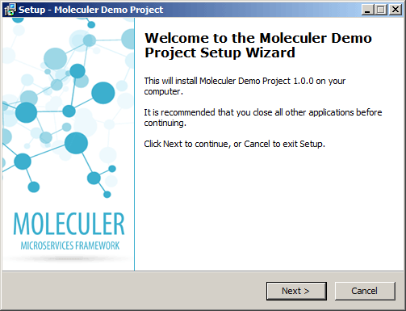
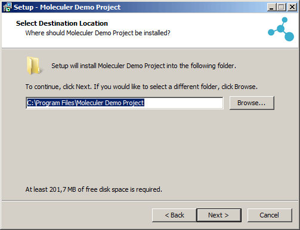
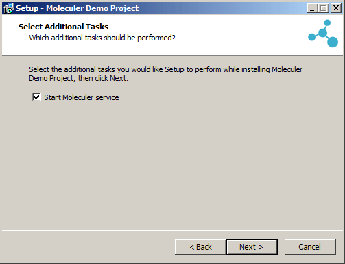
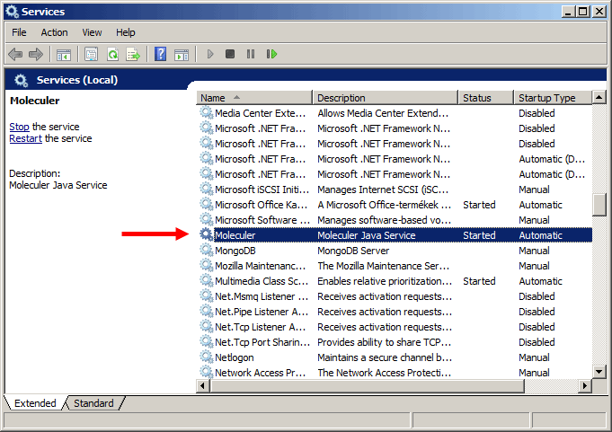

## Moleculer Java Demo Project

The project demonstrates a possible design of a functioning
[Moleculer](https://moleculer-java.github.io/site/)-based
web-application. The application is launched and configured by the Spring Boot Framework.
The project is a standard **Maven** project and can be imported into any modern IDE
(VS Code, IntelliJ IDEA, Eclipse).

The project also includes a Maven `installer` profile to create a **Windows Installer** from the project,
which installs the finished application as a 64-bit **Windows Service**.

The Windows Service creates a Moleculer Node that can be connected to another **Java or Node.js-based** Moleculer Node.

### Topics of the examples ###

- Integration of Moleculer API into the Spring Boot Framework
- Configuring HTTP Routes and Middlewares
- Creating non-blocking Moleculer Services and Event Listeners
- Publishing and invoking Moleculer Services as REST Services
- Generating HTML pages in multiple languages using Template Engines
- Using WebSockets (sending real-time server-side events to browsers)
- Using file upload and download
- Video streaming and server-side image generation
- Creating a WAR from the finished project (Servlet-based runtime)
- Run code without any changes in "standalone mode" (Netty-based runtime)

### Requirements ###

- **Java JDK 21 (LTS)** — the supported build and runtime baseline
- **Apache Maven 3.9+**

The build targets Java 21 (`<maven.compiler.release>21</maven.compiler.release>`) with the standard
`javac` compiler. The whole stack (Moleculer-Java 2.0.0, Spring Boot 3.5, Jakarta EE 10) is built for
Java 17+.

> **Runtime note:** the standalone (Netty) server is validated on **JDK 21**. The bundled
> Netty 4.2.15 runtime does **not** run correctly on **JDK 25+** yet (JDK 25 removed the
> `sun.misc.Unsafe` memory-access methods Netty relies on), so use a JDK 21 runtime for the
> standalone / installer mode. The WAR (servlet) mode follows whatever JDK its container runs on.

### Download binaries for testing ###

This web application can be deployed to any **Jakarta EE 10** servlet container
(Tomcat 10+, Jetty 12, WildFly 27+, GlassFish 7, Payara 6, Open Liberty, WebLogic 14.1.2+):

- **[Download WAR file for Jakarta EE Servers](https://github.com/moleculer-java/moleculer-spring-boot-demo/raw/master/installer/dist/moleculer-demo.war)**

After the deployment, the examples are available at a URL similar to the one below:

```
http://appserver-host:port/moleculer-demo
```

Download the 64-bit Windows Installer for testing the standalone, high performance but lightweight version of this demo:

- **[Download 64-bit Windows Installer](https://github.com/moleculer-java/moleculer-spring-boot-demo/raw/master/installer/dist/moleculer_setup_2.0.0.exe)**

> The WAR and the installer `.exe` are **generated** by the Maven build (see below). They are not
> committed to the repository; `installer/dist/` is `.gitignore`d.

After the installation, the application can be started in "development" or "production" mode.
For "development" mode, run the following BAT file:

```
C:\Program Files\Moleculer Demo Project\bin\development-start.bat
```
The application starts in "development" mode with an Interactive Console (enter "help" or "info" to try it out).
The sample programs are available at the following URL:
```
http://localhost:3000/
```
To exit the application, type "exit" in the Interactive Console.
In "production" mode, launch the application with "production-start.bat".
The demo will then run as a Windows Service in the background.
The application cannot run at the same time in "production" and "development" mode
because the two versions use the same port.
To stop the Windows Service, run "production-stop.bat".

### Compile and run from source code ###

The project is a standard Maven project; no IDE plugin is required.

**Run the standalone (Netty) version directly with Maven** — compile, then launch `MoleculerRunner`:

```
mvn compile
mvn exec:java -Dexec.mainClass=services.moleculer.config.MoleculerRunner -Dexec.args=my.application.MoleculerApplication
```

**Or configure a Run Configuration in your IDE** with the following parameters (a ready-made
VS Code launch configuration is provided in `.vscode/launch.json`):

- **Main class**: `services.moleculer.config.MoleculerRunner`
- **Program arguments**: `my.application.MoleculerApplication`
- **VM options**: `-Dlogging.config="classpath:logging-development.properties" -Djava.net.preferIPv4Stack=true -Dspring.profiles.active=development`

> Note: the old SIGAR-based CPU monitor (and its `-Djava.library.path=...` native libraries) has been
> removed — Moleculer-Java 2.0.0 auto-selects a JMX-based monitor (falling back to a constant monitor),
> so no native libraries are needed.

The app then serves the examples at `http://localhost:3000/` and opens an interactive REPL on stdin
(type `help`).

**Build the Web Application WAR**

To create a WAR for Jakarta EE servers, run:

```
mvn clean package
```

The WAR is generated into the `target/` directory as `moleculer-demo.war`.
It is built on the standard non-blocking **Jakarta** Servlet API (`web.xml` uses the
`jakartaee` 6.0 namespace) and is compatible with the following application servers:

- Apache Tomcat 10.1+
- Eclipse Jetty 12 (ee10)
- Red Hat JBoss EAP 8 / WildFly 27+
- Oracle WebLogic Server 14.1.2+
- GlassFish Server 7
- Payara Server 6
- IBM WebSphere / Open Liberty (Jakarta EE 10)

The WAR may work with other servers as well (it relies only on the standard Jakarta Servlet API).

**Build the Windows Installer**

The standalone version is not Servlet-based and relies on Netty for higher performance.
The project does not include any transporter libraries (JARs) in its initial state.
If you want to use transporters (such as Redis, Kafka or NATS) the transporter dependencies must be
added to the `pom.xml`.

To create the installer (Windows-only, opt-in), run:

```
mvn -Pinstaller package
```

The `installer` Maven profile:

1. copies the runtime dependency JARs into `target/lib` (`maven-dependency-plugin`),
2. packages the application classes into `target/lib/moleculer-demo.jar` (`maven-jar-plugin`),
3. generates a minimal **JDK 21+ runtime** into `target/jre` with `jlink`,
4. compiles `installer/moleculer.config.iss` into `installer/dist/moleculer_setup_2.0.0.exe`
   using the bundled Inno Setup compiler (`installer/setup/ISCC.exe`).

The Windows Service wrapper uses the current **Apache Commons Daemon** `prunsrv.exe` / `prunmgr.exe`
binaries (in `installer/bin/`).

> The `docs/*.png` screenshots show the original Gradle-based flow; the commands are now Maven
> (`mvn -Pinstaller package` instead of `gradle buildInstaller`).

The executable installer is generated into the `installer/dist` directory, as `moleculer_setup_2.0.0.exe`.
This installer creates all required libraries, the bundled Java runtime, and the configuration files
needed to run the service.







The Moleculer service can be found in the list of the Windows Services:



**Make your own service**

Copy the following code snippet into the "my.services" package/folder:

```java
package my.services;

import org.springframework.stereotype.Controller;

import io.datatree.Tree;
import services.moleculer.eventbus.Listener;
import services.moleculer.eventbus.Subscribe;
import services.moleculer.service.Action;
import services.moleculer.service.Name;
import services.moleculer.service.Service;

@Name("myService")
@Controller
public class MyService extends Service {

    // --- CALLABLE ACTION ---

    @Name("myAction")
    Action action = ctx -> {

        // Read request
        String var1 = ctx.params.get("var1", "defaultValue");
        long var2 = ctx.params.get("var2", 0L);

        // Create response
        Tree rsp = new Tree();
        rsp.put("key", "value");
        return rsp;
    };

    // --- EVENT LISTENER ---

    @Subscribe("myEvent")
    Listener myEventListener = ctx -> {

        // Process event's payload
        boolean var3 = ctx.params.get("key", false);
    };

}
```

The "ctx.params" and "rsp" variables are hierarchical [Tree structures](https://berkesa.github.io/datatree/) (~= JSONs).
For more information about using "Tree", see the JavaDoc of Tree.
At boot time the Spring Framework will automatically register this service as a distributed Moleculer Service,
which can be called by other (Java or Node.js) nodes.

## Moleculer Documentation

[](https://moleculer-java.github.io/site/introduction.html)

## License

Moleculer implementations are available under the [MIT license](https://tldrlegal.com/license/mit-license).
